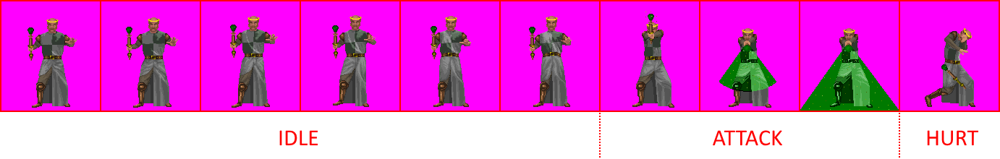

# Yendorian Tales 2 & 3 - game data reverse engineering
[Yendorian Tales 2 (Book I: Chapter 2)](https://www.mobygames.com/game/yendorian-tales-book-i-chapter-2) and [Yendorian Tales 3: The Tyrants of Thaine](https://www.mobygames.com/game/yendorian-tales-the-tyrants-of-thaine) are fairly forgotten games of the late 1990s which, by today's standards, can be considered a clone of [Might and Magic](https://www.mobygames.com/game-group/might-and-magic-series) series. The goal of this project is to extract and descibe basic data used by these games which could potentially lead to a modern remake or serve as a basis of a test project for a dungeon crawler game.
All work was done using the [HxD editor](https://mh-nexus.de/en/hxd/) and [DosBox debugger](https://www.vogons.org/viewtopic.php?t=7323) to track assembly calls.

## Graphics
Both games store image data in a dedicated `PICTURES.VGA` file which is an uncompressed stream of bytes - each one representing a single pixel referencing an index in a specific 256-color DOS palette. There's no size nor offset information stored in this file, everything is kept in the game's executable. Graphics are grouped by size, ranging from the largest (fullscreen images) to smallest (8x8 pixel icons used throughout the game). `PICTURES.VGA` is kept open during runtime and required images are fetched when necessary. Games run in mode 13h at all times, one exception being the Spectrum Pacific Publishing splash screen which is 640x480 pixels and stored in the executable as LOGO.PCX. For some reason this image is extracted and saved on the disk during startup, only to be removed after exiting the game.

### Color palette
Palette data was extracted using DosBox's screen capture and saved as binary `.pal` files. Final color is used for transparency information - the extracted palettes set that value to magenta (0xFF00FF) for better distinction (originally 0xFFFFFF is used). Most animation effects (enhanced weapons, texture shimmering) is achieved with color cycling - a common technique used in games at the time.

### Enemies

<p align="center"></p>

Enemies consist of 10 fixed-size frames: 6 frames for idle animations, 3 frames for attack, 1 frame for pain state - this is true even for creatures that don't have dedicated idle/attack/pain animations (like Dwarf Towers) - the images are simply duplicated. For multiple variants of the same enemy (Centipede/Millipede etc.) different palette colors are being used.

### Enemy data structure
Enemies take 106 bytes per creature in the `WORLD.DAT` file - starting at offset `0x1A7994` in Yendorian Tales 2 and `0x4170DF` in Yendorian Tales 3. Enough data has been reverse engineered to get basic stats and properties but there's still some information that needs to be discovered:
```c
    struct Enemy {
        char name[26];               // creature name
        uint16_t start_frame_offset; // presumably offset to first idle frame in PICTURES.VGA
        uint16_t <unknown>
        uint16_t health;             // creature stats
        uint16_t <unknown>
        uint16_t accuracy;           // creature stats
        uint16_t dexterity;          // creature stats
        uint16_t absorption;         // creature stats
        uint16_t damage;             // creature stats
        uint16_t attack_snd_index;   // .VOC file number
        uint16_t <unknown>
        uint16_t projectile_snd_index; // .VOC file number - no ranged attack if 0x00
        uint16_t projectile_image;   // offset to projectile image
        uint16_t ranged_acc;         // creature stats
        uint16_t ranged_dam;         // creature stats
        uint16_t <unknown>
        uint16_t <unknown>
        uint16_t <unknown>
        uint16_t special_attack1;    // 0x0F - Steal Gold, 0x10 - Steal Food, 0x11 - Steal Nuore, 0x15 - Poison, 0x18 - Sick, 0x19 - Jinxing, 0x1D - Disease, 0x1E - Sick+Poison+Disease, 0x24 - Paralyze, 0x25 - Hexing, 0x27 - Stoning, 0x28 - Frozen, 0x29 - Cursing
        uint16_t projectile_attack_type; // kill/effect type for projectile hit
        uint16_t <unknown>
        uint16_t <unknown>
        uint16_t <unknown>
        uint16_t <unknown>
        uint16_t <unknown>
        uint16_t <unknown>
        uint32_t gold;               // kill reward, decimal encoding - max 99,999,999
        uint32_t nuore;              // kill reward, decimal encoding - max 99,999,999
        uint32_t food;               // kill reward, decimal encoding - max 99,999,999
        uint32_t experience;         // kill reward, decimal encoding - max 99,999,999
        uint16_t <unknown>
        uint16_t <unknown>
        uint8_t  animation_flags;    // upper 4 bits - idle animation type: 0 - none, 1 - ping-pong, 2 - restart; lower 4 bits: still unknown, looks like some sort of additional offset
        uint8_t  special_attack2;    // 0x10 - Party Attack, 0x12 - Break Shield, 0x14 - Break Weapon, 0x16 - Break Weapon+Shield, 0x18 - Break Projectile - needs more investigation
        uint8_t  mobility;           // creature is mobile (0x00) or immobile - like Fungus or Dwarf Towers (0x02)
        uint8_t  translucency;       // determines if sprite is translucent (Ghost, Phase Titan) - 0x80 - on, 0x00 - off
        uint16_t immunity_bitmask;   // 0x01 - Power, 0x02 - Electricity, 0x04 - Cold, 0x08 - Fire, 0x10 - Magic Resistance, 0x0400 - Curse, 0x0800 - Hexing, 0x1000 - Freezing, 0x2000 - Paralysis, 0x4000 - Disease, 0x8000 - Poison
        uint8_t  <unknown>
        uint8_t  resistance_bitmask; // 0x80 - Physical Damage, 0x20 - Magical Damage, 0xA0 - Both
        uint16_t <unknown>
    }
```

### Scene elements
Most objects are duplicated in flipped and unflipped variants (used depending on player position in the world) - wasteful in terms of space but it seems this approach was easier for the developers. Some (for example portals) have a palette effect attached to them. All sky and ground textures are represented by two images - flipped and unflipped, even if there's only one variant used in the game (like Astral Plane sky texture).

## Audio
Both games use [Creative Voice File (.VOC)](http://www.shikadi.net/moddingwiki/VOC_Format) for digitized audio and [Creative Music File (.CMF)](http://www.shikadi.net/moddingwiki/CMF_Format) for music.

### Digitized sounds
Sound files are stored uncompressed in the game's `WORLD.DAT` file. Size information and file offsets are kept in the executable - for Yendorian Tales 2 (`SWREG.EXE`), sound data starts at offset `0x2EBF1` and for Yendorian Tales 3 (`REGISTER.EXE`), data starts at offset `0x2D057`. In both cases, the data block is followed by file sizes - 2 bytes per file followed by a 0x00 byte. Most modern media players (like [VLC](https://www.videolan.org)) support .VOC playback without any problem.

### Music
Unlike MIDI, this format stores instrument banks directly in the file - this way the playback sounds exactly the same with every audio driver. Just like digitized sounds, all .CMF files are stored uncompressed in `WORLD.DAT` with size and offset information being stored in the game's executable. For Yendorian Tales 2, music data starts at offset `0x2EB73` and for Yendorian Tales 3 it starts at `0x2CFC7`. The data block is followed by file sizes, following the same rule as with .VOC files (2 bytes per track followed by a 0x00 byte). Creative Music File is hardly supported by contemporary audio players, so the only way to play it back is to either use a music player in DosBox (like [MuchMusic](http://www.vgmpf.com/Wiki/index.php?title=MuchMusic)) or convert it to a more modern format.